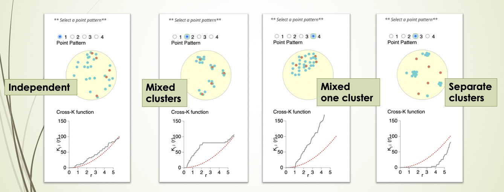

```{r setup, include=FALSE}
knitr::opts_chunk$set(echo = TRUE)
```

```{r message=FALSE}
library(SPIAT)
```

With SPIAT we can quantify cell colocalisation, which refers to how much
two cell types are colocalising and thus potentially interacting.

In this vignette we will use an inForm data file that's already been
formatted for SPIAT with `format_image_to_spe()`, which we can load with
`data()`. We will use `define_celltypes()` to define the cells with certain 
combinations of markers.

```{r}
data("simulated_image")

# define cell types
formatted_image <- define_celltypes(
    simulated_image, 
    categories = c("Tumour_marker","Immune_marker1,Immune_marker2", 
                   "Immune_marker1,Immune_marker3", 
                   "Immune_marker1,Immune_marker2,Immune_marker4", "OTHER"), 
    category_colname = "Phenotype", 
    names = c("Tumour", "Immune1", "Immune2", "Immune3", "Others"),
    new_colname = "Cell.Type")
```

# Cells In Neighbourhood (CIN)

We can calculate the average percentage of cells of one cell type
(target) within a radius of another cell type (reference) using
`average_percentage_of_cells_within_radius()`.

```{r}
average_percentage_of_cells_within_radius(spe_object = formatted_image, 
                                          reference_celltype = "Immune1", 
                                          target_celltype = "Immune2", 
                                          radius=100, feature_colname="Cell.Type")
```

Alternatively, this analysis can also be performed based on marker
intensities rather than cell types. Here, we use
`average_marker_intensity_within_radius()` to calculate the average
intensity of the target_marker within a radius from the cells positive
for the reference marker. Note that it pools all cells with the target
marker that are within the specific radius of any reference cell.
Results represent the average intensities within a radius.

```{r}
average_marker_intensity_within_radius(spe_object = formatted_image,
                                       reference_marker ="Immune_marker3",
                                       target_marker = "Immune_marker2",
                                       radius=30)
```

To help identify suitable radii for
`average_percentage_of_cells_within_radius()` and
`average_marker_intensity_within_radius()` users can use
`plot_average_intensity()`. This function calculates the average intensity
of a target marker for a number of user-supplied radii values, and plots
the intensity level at each specified radius as a line graph. The radius
unit is microns.

```{r, fig.height = 2.2, fig.width = 4}
plot_average_intensity(spe_object=formatted_image, reference_marker="Immune_marker3", 
                       target_marker="Immune_marker2", radii=c(30, 35, 40, 45, 50, 75, 100))
```

This plot shows low levels of Immune_marker3 were observed in cells near
Immune_marker2+ cells and these levels increased at larger radii. This
suggests Immune_marker2+ and Immune_marker3+ cells may not be closely
interacting and are actually repelled.

# Mixing Score (MS) and Normalised Mixing Score (NMS)

This score was originally defined as the number of immune-tumour
interactions divided by the number of immune-immune interactions
[@keren2018structured]. SPIAT generalises this method for any
user-defined pair of cell types. `mixing_score_summary()` returns the
mixing score between a reference cell type and a target cell type. This
mixing score is defined as the number of target-reference
interactions/number of reference-reference interactions within a
specified radius. The higher the score the greater the mixing of the two
cell types. The normalised score is normalised for the number of target
and reference cells in the image.

```{r}
mixing_score_summary(spe_object = formatted_image, reference_celltype = "Immune1", 
                     target_celltype = "Immune2", radius=100, feature_colname ="Cell.Type")
```

# Cross K function

Cross K function calculates the number of target cell types across a
range of radii from a reference cell type, and compares the behaviour of
the input image with an image of randomly distributed points using a
Poisson point process. There are four patterns that can be distinguished
from K-cross function, as illustrated in the plots below. (taken from
[here](https://blog.jlevente.com/understanding-the-cross-k-function/) in
April 2021).

```{r, echo=FALSE, fig.width = 2, fig.height = 1, out.width = "100%"}

```

Here, the black line represents the input image, the red line represents
a randomly distributed point pattern.

-   1st plot: The red line and black line are close to each other,
    meaning the two types of points are randomly independently
    distributed.\
-   2nd plot: The red line is under the black line, with a large
    difference in the middle of the plot, meaning the points are mixed
    and split into clusters.\
-   3rd plot: With the increase of radius, the black line diverges
    further from the red line, meaning that there is one mixed cluster
    of two types of points.\
-   4th plot: The red line is above the black line, meaning that the two
    types of points form separated clusters.

We can calculate the cross K-function using SPIAT. Here, we need to
define which are the cell types of interest. In this example, we are
using Tumour cells as the reference population, and Immune3 cells as the
target population.

```{r,fig.width = 4.2}
df_cross <- calculate_cross_functions(formatted_image, method = "Kcross", 
                                      cell_types_of_interest = c("Tumour","Immune2"), 
                                      feature_colname ="Cell.Type",
                                      dist = 100)
```

The results shows similar pattern as the 4th plot in the cross K
diagram. This means "Tumour" cells and "Immune2" cells are not
colocalised (or form separate clusters).

We can calculate the area under the curve (AUC) of the cross K-function.
In general, this tells us the two types of cells are:

-   negative values: separate clusters
-   positive values: mixing of cell types

```{r}
AUC_of_cross_function(df_cross)
```

The AUC score is close to zero so this tells us that the two types of
cells either do not have a relationship or they form a ring surrounding
a cluster.

# Cross-K Intersection (CKI)

There is another pattern in cross K curve which has not been previously
appreciated, which is when there is a "ring" of one cell type, generally
immune cells, surrounding the area of another cell type, generally
tumour cells. For this pattern, the observed and expected curves in
cross K function cross or intersect, such as the cross K plot above.

We note that crossing is not exclusively present in cases where there is
an immune ring. When separate clusters of two cell types are close,
there can be a crossing at a small radius. In images with infiltration,
crossing may also happen at an extremely low distances due to
randomness. To use the CKI to detect a ring pattern, users need to
determine a threshold for when there is a true immune ring. Based on
our tests, these generally fall within at a quarter to half of the
image size, but users are encouraged to experiment with their datasets.

Here we use the colocalisation of "Tumour" and "Immune3" cells as an
example. Let's revisit the example image.

```{r, echo = FALSE, fig.height = 2.5}
my_colors <- c("red", "blue", "darkcyan", "darkgreen")
plot_cell_categories(formatted_image, c("Tumour", "Immune1", "Immune2", "Immune3"), 
                     my_colors, "Cell.Type")
```

Compute the cross K function between "Tumour" and "Immune3":

```{r, fig.width = 4}
df_cross <- calculate_cross_functions(formatted_image, method = "Kcross", 
                                      cell_types_of_interest = c("Tumour","Immune3"), 
                                      feature_colname ="Cell.Type",
                                      dist = 100)
```

Then find the intersection of the observed and expected cross K curves.

```{r}
crossing_of_crossK(df_cross)
```

The result shows that the crossing happens at 50% of the specified
distance (100) of the cross K function, which is very close to the edge
of the tumour cluster. This means that the crossing is not due to the
randomness in cell distribution, nor due to two close located immune and
tumour clusters. This result aligns with the observation that there is
an immune ring surrounding the tumour cluster.

# You can access the vignettes for other modules of SPIAT here:

 - [Overview of SPIAT](SPIAT.html)
 - [Data reading and formatting](data_reading-formatting.html)
 - [Quality control and visualisation](quality-control_visualisation.html)
 - [Basic analysis](basic_analysis.html)
 - [Spatial heterogeneity](spatial-heterogeneity.html)
 - [Tissue structure](tissue-structure.html)
 - [Cellular neighborhood](neighborhood.html)
 
# Reproducibility

```{r}
sessionInfo()
```

# Author Contributions

AT, YF, TY, ML, JZ, VO, MD are authors of the package code. MD and YF
wrote the vignette. AT, YF and TY designed the package.