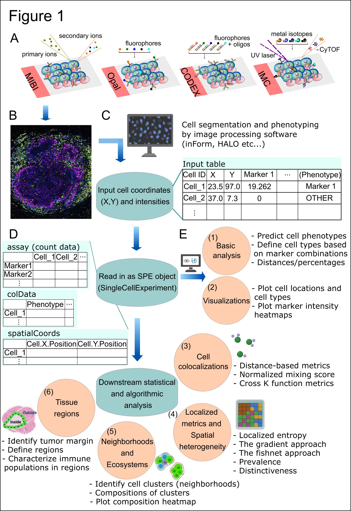
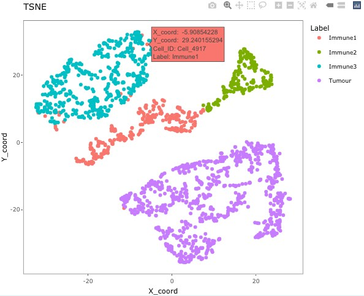
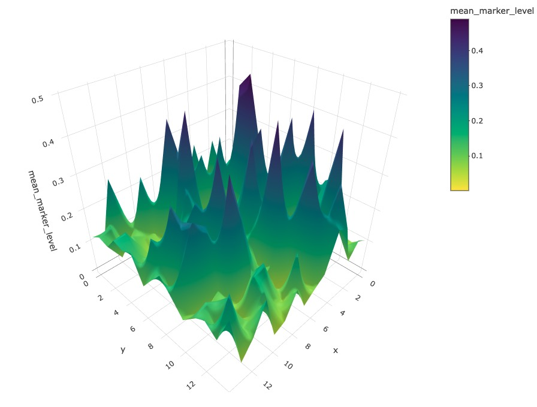

```{r setup, include=FALSE}
knitr::opts_chunk$set(
  collapse = TRUE,
  comment = "#>",
  crop = NULL,
  echo = TRUE, fig.width = 3.8, fig.height = 3.8, dpi = 72, out.width = "60%")
```

# Basics

## Introduction

SPIAT (**Sp**atial **I**mage **A**nalysis of **T**issues) is an R
package with a suite of data processing, quality control, visualisation and data 
analysis tools. SPIAT is compatible with data
generated from single-cell spatial proteomics platforms (e.g. OPAL,
CODEX, MIBI, cellprofiler). SPIAT reads spatial data in the form of X and Y
coordinates of cells, marker intensities and cell phenotypes.

SPIAT includes six analysis modules that allow visualisation,
calculation of cell colocalisation, categorisation of the immune
microenvironment relative to tumour areas, analysis of cellular
neighborhoods, and the quantification of spatial heterogeneity,
providing a comprehensive toolkit for spatial data analysis.

An overview of the functions available is shown in the figure below.

```{r, echo=FALSE, fig.height=4.2, fig.width=2.6, fig.align='centre', out.width = "85%"}

```

## Installing `SPIAT`

`r Biocpkg("SPIAT")` is a `R` package available via the
[Bioconductor](http://bioconductor.org) repository for packages. 

```{r install, eval = FALSE}
if (!requireNamespace("BiocManager", quietly = TRUE)) {
      install.packages("BiocManager")}
# The following initialises usage of Bioc devel
BiocManager::install(version="devel")
BiocManager::install("SPIAT")
```

You can also install the latest development version from Github.

## Citing `SPIAT`

We hope that `r Biocpkg("SPIAT")` will be useful for your research.
Please use the following information to cite the package and the overall
approach. Thank you!

```{r "citation"}
## Citation info
citation("SPIAT")
```

# Tutorial

## Reading in data and basic data formatting in SPIAT

First we load the SPIAT library.

```{r message=FALSE}
library(SPIAT)
```

`format_image_to_spe()` is the main function to read in data to
SPIAT. `format_image_to_spe()` creates a `SpatialExperiment` object which is
used in all subsequent functions. The key data points of interest for
SPIAT are cell coordinates, marker intensities and cell phenotypes for
each cell.

`format_image_to_spe()` has specific options to read in data generated
from inForm, HALO, CODEX and cellprofiler.
However, we advice pre-formatting the data before input to SPIAT so that
accepted by the 'general' option (shown below). This is due to often
inconsistencies in the column names or data formats across different
versions or as a result of different user options when using the other
platforms.

### Reading in data through the 'general' option (RECOMMENDED)

Format "general" allows you to input a matrix of intensities
(`intensity_matrix`), and a vector of `phenotypes`, which should be in
the same order in which they appear in the `intensity_matrix`. They must
be of the form of marker combinations (e.g. "CD3,CD8"), as opposed to cell 
names (e.g. "cytotoxic T cells"), as SPIAT does matching with the
marker names. `phenotypes` is an optional parameter and can be set as `NULL` if 
no phenotypes are available. The user also needs to provide separate vectors 
with the X and Y coordinates of the cells (`coord_x` and `coord_y`). The cells 
must be in the same order as in the `intensity_matrix`. If you have `Xmin`, 
`Xmax`,`Ymin` and `Ymax` columns in the raw data, we advise calculating the 
average to obtain a single X and Y coordinate, which you can then use as input 
to `coord_x` and `coord_y`.

Here we use some dummy data to illustrate how to read "general" format.

```{r}
# Construct a dummy marker intensity matrix
## rows are markers, columns are cells
intensity_matrix <- matrix(c(14.557, 0.169, 1.655, 0.054,
                             17.588, 0.229, 1.188, 2.074, 
                             21.262, 4.206,  5.924, 0.021), nrow = 4, ncol = 3)
# define marker names as rownames
rownames(intensity_matrix) <- c("DAPI", "CD3", "CD4", "AMACR")
# define cell IDs as colnames
colnames(intensity_matrix) <- c("Cell_1", "Cell_2", "Cell_3") 

# Construct a dummy metadata (phenotypes, x/y coordinates)
# the order of the elements in these vectors correspond to the cell order 
# in `intensity matrix`
phenotypes <- c("OTHER",  "AMACR", "CD3,CD4")
coord_x <- c(82, 171, 184)
coord_y <- c(30, 22, 38)

general_format_image <- format_image_to_spe(format = "general", 
                                            intensity_matrix = intensity_matrix,
                                            phenotypes = phenotypes, 
                                            coord_x = coord_x,coord_y = coord_y)
```

The formatted image now contains phenotypes, locations, and marker
intensity information of 3 cells. Note that if users want to define cell
IDs, the cell IDs should be defined as the colnames of the intensity
matrix. The order of the rows of the metadata should correspond to the order 
of the colnames of the intensity matrix. The function will automatically assign 
rownames to the `spatialCoords()` and `colData()` of the image (now as a 
`spatialExperiment` object).

Use the following code to inspect the information.

```{r}
# phenotypes and cell properties (if available)
colData(general_format_image)
# cell coordinates
spatialCoords(general_format_image)
# marker intensities
assay(general_format_image)
```

### Reading in data pre-formatted by other software

If you prefer to use data directly generated from inForm, HALO, CODEX or 
cellprofiler, these can be specified by `format` param in
`format_image_to_spe()`. We will show examples for the inForm and HALO formats.

For reading in input generated with CODEX or cellprofiler see
the documentations (`?format_image_to_spe`).

#### Reading in data from inForm

To read in data from inForm, you need the table file generated by
inForm containing the cell IDs, cell locations, phenotypes (if available) and 
marker intensities. You also need to extract a vector of marker names and marker 
locations ("Nucleus", "Cytoplasm", or "Membrane"). `format_image_to_spe()` uses 
the "Cell X Position" and "Cell Y Position" columns and the "Phenotype" column 
in the inForm raw data. The phenotype of a cell can be a single marker, 
for example, "CD3", or a combination of markers, such as "CD3,CD4". As a 
convention, SPIAT assumes that cells marked as "OTHER" in "inForm" refer to 
cells positive for DAPI but no other marker.
The phenotypes must be based on the markers (e.g. CD3,CD4), rather than
names of cells (e.g. cytotoxic T cells). The names of the cells (e.g. cytotoxic 
T cells) can be added later using the `define_celltypes()` function. 
The following cell properties columns are also required to be present in the 
inForm input file: Entire Cell Area (pixels), Nucleus Area (pixels), Nucleus
Compactness, Nucleus Axis Ratio, and Entire Cell Axis Ratio. If not
present in the raw data, these can be columns with NAs.

To read in inForm data, you need to specify the following parameters:

-   `format`: "inForm"
-   `path`: path to the raw inForm image data file
-   `markers`: names of markers used in the OPAL staining. These must be
    in the same order as the marker columns in the input file, and must match 
    the marker names used in the input file. One of the markers must be "DAPI".
-   `locations`: locations of the markers in cells, either "Nucleus",
    "Cytoplasm" or "Membrane." These must be in the same order as `markers`.
    The locations are used to auto-detect the intensity (and dye)
    columns.

A small example of inForm input is included in SPIAT containing dummy
marker intensity values and all the other required columns (see below).
This example file is just for demonstrating importing a raw data file,
later in the [Inspecting the SpaitalExperiment object](#example-data) 
section we will load a larger preformatted dataset. Users are welcome to 
use this formatting option (`format = 'inForm'`) if it is closer to the 
format of their files.

```{r message=FALSE}
raw_inform_data <- system.file("extdata", "tiny_inform.txt.gz", package = "SPIAT")
markers <- c("DAPI", "CD3", "PD-L1", "CD4", "CD8", "AMACR")
locations <- c("Nucleus","Cytoplasm", "Membrane","Cytoplasm","Cytoplasm",
               "Cytoplasm") # The order is the same as `markers`.
formatted_image <- format_image_to_spe(format="inForm", path=raw_inform_data, 
                                       markers=markers, locations=locations)
```

Alternatively, rather than specifying the `locations`, you can also
specify the specific intensity columns with the parameter 
`intensity_columns_interest` as shown below.

```{r message=FALSE}
raw_inform_data <- system.file("extdata", "tiny_inform.txt.gz", package = "SPIAT")
markers <- c("DAPI", "CD3", "PD-L1", "CD4", "CD8", "AMACR")
intensity_columns_interest <- c(
  "Nucleus DAPI (DAPI) Mean (Normalized Counts, Total Weighting)",
  "Cytoplasm CD3 (Opal 520) Mean (Normalized Counts, Total Weighting)", 
  "Membrane PD-L1 (Opal 540) Mean (Normalized Counts, Total Weighting)",
  "Cytoplasm CD4 (Opal 620) Mean (Normalized Counts, Total Weighting)",
  "Cytoplasm CD8 (Opal 650) Mean (Normalized Counts, Total Weighting)", 
  "Cytoplasm AMACR (Opal 690) Mean (Normalized Counts, Total Weighting)"
  ) # The order is the same as `markers`.
formatted_image <- format_inform_to_spe(path=raw_inform_data, markers=markers,
                     intensity_columns_interest=intensity_columns_interest)
class(formatted_image) # The formatted image is a SpatialExperiment object
dim(colData(formatted_image))
dim(assay(formatted_image))
```

#### Reading in data from HALO

To read in data from HALO, you need the table file generated by HALO. 
The biggest difference between inForm and HALO formats is the coding of the cell 
phenotypes. While inForm
encodes phenotypes as the combination of positive markers (e.g.
"CD3,CD4"), HALO uses a binary system where 1 means the cell is positive for
the marker and 0 otherwise.

`format_image_to_spe()` for "HALO" format collapses HALO encoded phenotypes 
into an inForm-like format to create the `Phenotype` column. For example, 
if HALO has assigned a cell a marker status of 1 for CD3 and 1 for CD4, SPIAT
will give it the Phenotype "CD3,CD4". Cells that have a marker status of
1 for DAPI but no other marker are given the phenotype "OTHER".

`format_image_to_spe()` takes the average of the HALO X min and X max
columns for each cell to create the `Cell.X.Position` column. It takes the
average of the Y min and Y max to create the `Cell.Y.Position` column.

To read in HALO data, you need to specify the following parameters:

-   `format`: "HALO"
-   `path`: path to the raw HALO image data file
-   `markers`: names of markers used in the OPAL staining. These must be
    in the same order as the marker columns in the input file, and must match 
    the marker names used in the input file. One of the markers must be DAPI.
-   `locations`: locations of the markers in cells, either "Nucleus",
    "Cytoplasm" or "Membrane." These must be in the order of the `markers`.
    The locations are used to auto-detect the intensity (and dye) columns.
-   `intensity_columns_interest` use if `locations` is not specified. Vector 
    with the names of the columns with the level of each marker. Column names 
    must match the order of the `markers` parameter. 
-   `dye_columns_interest` Use if locations is not specified. Vector of names 
     of the columns with the marker status (i.e. those indicating 1 or 0 for 
     whether the cell is positive or negative for the marker). Column names 
     must match the order of the `markers` parameter.

Users can specify the `locations` to auto-detect the columns as shown
above for inForm. Alternatively, if users want to specify the columns
instead, you can do so with `intensity_columns_interest`, as shown in
the example below. Note that then you also must specify
`dye_columns_interest`. The following cell properties columns are also
required to be present in the HALO input file: Cell Area, Nucleus Area,
Cytoplasm Area. If these are not present in the user's data, we
recommend adding these columns with NA values.

```{r message=FALSE}
raw_halo_data <- system.file("extdata", "tiny_halo.csv.gz", package = "SPIAT")
markers <- c("DAPI", "CD3", "PD-L1", "CD4", "CD8", "AMACR")
intensity_columns_interest <- c("Dye 1 Nucleus Intensity",
                                "Dye 2 Cytoplasm Intensity",
                                "Dye 3 Membrane Intensity",
                                "Dye 4 Cytoplasm Intensity",
                                "Dye 5 Cytoplasm Intensity",
                                "Dye 6 Cytoplasm Intensity")
dye_columns_interest <- c("Dye 1 Positive Nucleus",
                          "Dye 2 Positive Cytoplasm",
                          "Dye 3 Positive Membrane",
                          "Dye 4 Positive Cytoplasm",
                          "Dye 5 Positive Cytoplasm",
                          "Dye 6 Positive Cytoplasm")
formatted_image <- format_halo_to_spe(
  path=raw_halo_data, markers=markers,
  intensity_columns_interest=intensity_columns_interest,
  dye_columns_interest=dye_columns_interest)
class(formatted_image) # The formatted image is a SpatialExperiment object
dim(colData(formatted_image))
dim(assay(formatted_image))
```

## Inspecting the SpaitalExperiment object

### Structure of a SPIAT SpatialExperiment object {#example-data}

In this vignette we will use an inForm data file that's already been
formatted for SPIAT with `format_image_to_spe()`, which we can load with
`data`.

```{r}
data("simulated_image")
```

This is in `SpatialExperiment` format.

```{r}
class(simulated_image)
```

This example data has 5 markers and 4951 cells.

```{r}
dim(simulated_image)
```

`assay()` stores the intensity level of every marker (rows) for every cell
(columns).

```{r}
# take a look at first 5 columns
assay(simulated_image)[, 1:5]
```

`colData()` stores the phenotype and cell properties. Note that the 
`sample_id` column was added by `SpatialExperiment` data structure and can be 
ignored here.

```{r}
# take a look at first 5 rows
colData(simulated_image)[1:5, ]
```

`spatialCoords()` stores cell coordinates. 
```{r}
# take a look at first 5 rows
spatialCoords(simulated_image)[1:5, ]
```

We can check what phenotypes are there.

```{r}
unique(simulated_image$Phenotype)
```

The phenotypes in this example data can be interpreted as follows:

- Tumour_marker = cancer cells
- Immune_marker1,Immune_marker2 = immune cell type 1 
- Immune_marker1,Immune_marker3 = immune cell type 2
- Immune_marker1,Immune_marker2,Immune_marker4 = immune cell type 3 
- OTHER = other cell types

### Nomenclature

In SPIAT We define as **markers** proteins whose levels where queried
by OPAL, CODEX or other platforms.

Examples of markers are "AMACR" for prostate cancer cells, "panCK" for
epithelial tumour cells, "CD3" for T cells or "CD20" for B cells.

The combination of markers results in a specific **cell phenotype**. For
example, a cell positive for both "CD3" and "CD4" markers has the
"CD3,CD4" **cell phenotype**. **The phenotype has to be strictly formatted in such**
**way where each positive marker has to be separated by a coma, with no space in** 
**between, and the order of the positive markers has to be the same as the order **
**in `assay()`.**

Finally, we define a **cell type** as a name assigned by the user to a
cell phenotype. For example, a user can name "CD3,CD4" cells as "helper
T cells". We would refer to "helper T cells" therefore as a **cell
type**.

### Splitting images

In the case of large images, or images where there are two independent
tissue sections, it is recommended to split images into sections defined
by the user. This can be performed with `image_splitter()` after
`format_image_to_spe()`.

```{r}
split_image <- image_splitter(simulated_image, number_of_splits=3, plot = FALSE)
```

### Predicting cell phenotypes

SPIAT can predict cell phenotypes using marker intensity levels with
`predict_phenotypes()`. This can be used to check the phenotypes that have
been assigned by inForm and HALO. It can also potentially be used to
automate the manual phenotyping performed with inForm/HALO. The
underlying algorithm is based on the density distribution of marker
intensities. We have found this algorithm to perform best in OPAL data. Further 
phenotyping methods for other data formats are under development. 

This algorithm does not take into account cell shape or size, so if these are 
required for phenotyping, using HALO or inForm or a machine-learning based 
method is recommended.

`predict_phenotypes()` produces a density plot that shows the cutoff for
calling a cell positive for a marker. If the dataset includes phenotypes
obtained through another software, this function prints to the console
the concordance between SPIAT's prediction and pre-defined phenotypes as
the number of true positives (TP), true negatives (TN), false positives
(FP) and false negatives (FN) phenotype assignments. It returns a table
containing the phenotypes predicted by SPIAT and the actual phenotypes
from inForm/HALO (if available).

```{r, fig.height=6, fig.width = 4}
predicted_image <- predict_phenotypes(spe_object = simulated_image,
                                      thresholds = NULL,
                                      tumour_marker = "Tumour_marker",
                                      baseline_markers = c("Immune_marker1", 
                                                           "Immune_marker2", 
                                                           "Immune_marker3", 
                                                           "Immune_marker4"),
                                      reference_phenotypes = TRUE)
```

We can use `marker_prediction_plot()` to plot the predicted cell
phenotypes and the phenotypes generated from the platforms for comparison.

```{r, fig.width = 9, fig.height=2, out.width="100%"}
marker_prediction_plot(predicted_image, marker="Immune_marker1")
```

The plot shows Immune_marker1+ cells in the tissue. On the left are the
Immune_marker1+ cells defined by the simulated image and on the right are the
Immune_marker1+ cells predicted using SPIAT. Since we know that the simulated 
phenotypes are the truth, we leave the phenotypes as they are.

The next example shows how to replace the original phenotypes with the
predicted ones. Note that for this tutorial, we still use the original
phenotypes.

```{r, eval=FALSE}
predicted_image2 <- predict_phenotypes(spe_object = simulated_image,
                                      thresholds = NULL,
                                      tumour_marker = "Tumour_marker",
                                      baseline_markers = c("Immune_marker1", 
                                                           "Immune_marker2", 
                                                           "Immune_marker3", 
                                                           "Immune_marker4"),
                                      reference_phenotypes = FALSE)
```

```{r, include=FALSE}
predicted_image2 <- predict_phenotypes(spe_object = simulated_image,
                                      thresholds = NULL,
                                      tumour_marker = "Tumour_marker",
                                      baseline_markers = c("Immune_marker1", 
                                                           "Immune_marker2", 
                                                           "Immune_marker3", 
                                                           "Immune_marker4"),
                                      reference_phenotypes = FALSE)
```

### Specifying cell types

SPIAT can define cell types with the `define_celltypes()` function. By
default the new column for cell types is called `Cell.Type`. The cell types can 
be defined based on `Phenotype` column, as well as other columns. 

```{r}
formatted_image <- define_celltypes(
    simulated_image, 
    categories = c("Tumour_marker","Immune_marker1,Immune_marker2", 
                   "Immune_marker1,Immune_marker3", 
                   "Immune_marker1,Immune_marker2,Immune_marker4", "OTHER"), 
    category_colname = "Phenotype", 
    names = c("Tumour", "Immune1", "Immune2", "Immune3", "Others"),
    new_colname = "Cell.Type")
```

## Quality control

Here we present some quality control steps implemented in SPIAT to check
for the quality of phenotyping, help detect uneven staining, and other
potential technical artefacts.

### Boxplots of marker intensities

Phenotyping of cells can be verified comparing marker intensities of
cells labelled positive and negative for a marker. Cells positive for a
marker should have high levels of the marker. An unclear separation of
marker intensities between positive and negative cells would suggest
phenotypes have not been accurately assigned. We can use
`marker_intensity_boxplot()` to produce a boxplot for cells phenotyped as
being positive or negative for a marker.

```{r, fig.height = 2, fig.width = 3.2}
marker_intensity_boxplot(formatted_image, "Immune_marker1")
```

Note that if phenotypes were obtained from software that uses machine
learning to determine positive cells, which generally also take into
account properties such as cell shape, nucleus size etc., rather than a
strict threshold, some negative cells will have high marker intensities,
and vice versa. In general, a limited overlap of whiskers or outlier
points is tolerated and expected. However, overlapping boxplots suggests
unreliable phenotyping.

### Scatter plots of marker levels

Uneven marker staining or high background intensity can be identified
with `plot_cell_marker_levels()`. This produces a scatter plot of the
intensity of a marker in each cell. This should be relatively even
across the image and all phenotyped cells. Cells that were not
phenotyped as being positive for the particular marker are excluded.

```{r, fig.height=3, fig.width=6, dpi = 72, out.width="100%"}
plot_cell_marker_levels(formatted_image, "Immune_marker1")
```

### Heatmaps of marker levels

For large images, there is also the option of 'blurring' the image,
where the image is split into multiple small areas, and marker
intensities are averaged within each. The image is blurred based on the
`num_splits` parameter.

```{r, fig.height = 2.2, out.width="75%"}
plot_marker_level_heatmap(formatted_image, num_splits = 100, "Tumour_marker")
```

### Identifying incorrect phenotypes

We may see cells with biologically implausible combination of markers
present in the input data when using `unique(spe_object$Phenotype)`. 
For example, cells might be incorrectly typed as positive for two markers known 
to not co-occur in a single cell type. Incorrect cell phenotypes may be present
due to low cell segmentation quality, antibody 'bleeding' from one cell
to another or inadequate marker thresholding.

If the number of incorrectly phenotyped cells is small (\<5%), we advise
simply removing these cells (see below). If it is a higher proportion,
we recommend checking the cell segmentation and phenotyping methods, as
a more systematic problem might be present.

### Removing cells with incorrect phenotypes

If you identify incorrect phenotypes or have any properties (columns) that you 
want to exclude you can use `select_celltypes()`. Set `celltypes` the values 
that you want to keep or exclude for a column (`feature_colname`). Set `keep` 
as `TRUE` to include these cells and `FALSE` to exclude them.

```{r}
data_subset <- select_celltypes(
  formatted_image, keep=TRUE,
  celltypes = c("Tumour_marker","Immune_marker1,Immune_marker3", 
                "Immune_marker1,Immune_marker2",
                "Immune_marker1,Immune_marker2,Immune_marker4"),
  feature_colname = "Phenotype")
# have a look at what phenotypes are present
unique(data_subset$Phenotype)
```

In this vignette we will work with all the original phenotypes present
in `formatted_image`.

### Dimensionality reduction to identify misclassified cells

We can also check for specific misclassified cells using dimensionality
reduction. SPIAT offers tSNE and UMAPs based on marker intensities to
visualise cells. Cells of distinct types should be forming clearly
different clusters.

The generated dimensionality reduction plots are interactive, and users
can hover over each cell and obtain the cell ID. Users can then remove
specific misclassified cells.

```{r}
predicted_image2 <- define_celltypes(
  predicted_image2, 
  categories = c("Tumour_marker", "Immune_marker1,Immune_marker2",
                 "Immune_marker1,Immune_marker3", 
                 "Immune_marker1,Immune_marker2,Immune_marker4"), 
  category_colname = "Phenotype",
  names = c("Tumour", "Immune1", "Immune2",  "Immune3"),
  new_colname = "Cell.Type")

# Delete cells with unrealistic marker combinations from the dataset
predicted_image2 <- 
  select_celltypes(predicted_image2, "Undefined", feature_colname = "Cell.Type",
                   keep = FALSE)

# TSNE plot
g <- dimensionality_reduction_plot(predicted_image2, plot_type = "TSNE", 
                                   feature_colname = "Cell.Type")
```

Note that `dimensionality_reduction_plot()` only prints a static version
of the UMAP or tSNE plot. If the user wants to interact with this plot,
they can pass the result to the `ggplotly()` function from the `plotly`
package. Due to the file size restriction, we only show a screenshot of
the interactive tSNE plot.

```{r, echo=TRUE, eval=FALSE}
plotly::ggplotly(g) 
```

```{r, echo=FALSE, fig.width = 4, fig.height = 4, out.width = "70%"}

```

The plot shows that there are four clear clusters based on marker
intensities. This is consistent with the cell definition from the marker
combinations from the "Phenotype" column. (The interactive t-SNE plot
would allow users to hover the cursor on the misclassified cells and see
their cell IDs.) In this example, Cell_3302, Cell_4917, Cell_2297,
Cell_488, Cell_4362, Cell_4801, Cell_2220, Cell_3431, Cell_533,
Cell_4925, Cell_4719, Cell_469, Cell_1929, Cell_310, Cell_2536,
Cell_321, and Cell_4195 are obviously misclassified according to this
plot.

We can use `select_celltypes()` to delete the misclassified cells.

```{r, eval=FALSE}
predicted_image2 <- 
  select_celltypes(predicted_image2, c("Cell_3302", "Cell_4917", "Cell_2297", 
                                       "Cell_488", "Cell_4362", "Cell_4801", 
                                       "Cell_2220", "Cell_3431", "Cell_533", 
                                       "Cell_4925", "Cell_4719", "Cell_469", 
                                       "Cell_1929", "Cell_310", "Cell_2536", 
                                       "Cell_321", "Cell_4195"), 
                   feature_colname = "rowname", keep = FALSE)
```

Then plot the TSNE again (not interactive). This time we see there are
fewer misclassified cells.

```{r, eval=FALSE}
# TSNE plot
g <- dimensionality_reduction_plot(predicted_image2, plot_type = "TSNE", feature_colname = "Cell.Type")

# plotly::ggplotly(g) # uncomment this code to interact with the plot
```

```{r, echo=FALSE, fig.width = 4, fig.height = 4, out.width = "70%"}
knitr::include_graphics("tSNE2.jpg")
```

## Visualising tissues

In addition to the marker level tissue plots for QC, SPIAT has other
methods for visualising markers and phenotypes in tissues.

### Categorical dot plot

We can see the location of all cell types (or any column in the data) in
the tissue with `plot_cell_categories()`. Each dot in the plot corresponds
to a cell and cells are coloured by cell type. Any cell types present in
the data but not in the cell types of interest will be put in the
category "OTHER" and coloured lightgrey.

```{r, fig.height = 2.5}
my_colors <- c("red", "blue", "darkcyan", "darkgreen")
  
plot_cell_categories(spe_object = formatted_image, 
                     categories_of_interest = 
                       c("Tumour", "Immune1", "Immune2", "Immune3"), 
                     colour_vector = my_colors, feature_colname = "Cell.Type")
```

`plot_cell_categories()` also allows the users to plot the categories layer by
layer when there are too many cells by setting `layered` parameter as `TRUE`. 
Then the cells will be plotted in the order of `categories_of_interest` layer 
by layer. Users can also use `cex` parameter to change the size of the points.

### 3D surface plot

We can visualise a selected marker in 3D with `marker_surface_plot()`. The
image is blurred based on the `num_splits` parameter.

```{r, eval=FALSE}
marker_surface_plot(formatted_image, num_splits=15, marker="Immune_marker1")
```

Due to the restriction of the file size, we have disabled the
interactive plot in this vignette. Here only shows a screen shot. (You
can interactively move the plot around to obtain a better view with the
same code).

```{r, echo=FALSE, out.width = "75%"}

```

### 3D stacked surface plot

To visualise multiple markers in 3D in a single plot we can use
`marker_surface_plot_stack()`. This shows normalised intensity level of
specified markers and enables the identification of co-occurring and
mutually exclusive markers.

```{r, eval=FALSE}
marker_surface_plot_stack(formatted_image, num_splits=15, markers=c("Tumour_marker", "Immune_marker1"))
```

```{r, echo=FALSE, out.width = "75%"}
knitr::include_graphics("marker_surface2.jpg")
```

The stacked surface plots of the Tumour_marker and Immune_marker1 cells
in this example shows how Tumour_marker and Immune_marker1 are mutually
exclusive as the peaks and valleys are opposite. Similar to the previous
plot, we have disabled the interactive plot in the vignette. (You can
interactively move the plot around to obtain a better view with the same
code.)

## Basic analyses

For this part of the tutorial, we will be performing some basic analysis
on this image:

```{r, fig.height = 2.5}
my_colors <- c("red", "blue", "darkcyan", "darkgreen")
  
plot_cell_categories(spe_object = formatted_image, 
                     categories_of_interest = 
                       c("Tumour", "Immune1", "Immune2", "Immune3"), 
                     colour_vector = my_colors, 
                     feature_colname = "Cell.Type")
```

### Cell percentages

We can obtain the number and proportion of each cell type with
`calculate_cell_proportions()`. We can use `reference_celltypes` to
specify cell types to use as the reference. For example, "Total" will
calculate the proportion of each cell type against all cells. We can
exclude any cell types that are not of interest e.g. "Undefined" with
`celltypes_to_exclude`.

```{r, fig.width=3, fig.height = 2.2}
p_cells <- calculate_cell_proportions(formatted_image, 
                                      reference_celltypes = NULL, 
                                      feature_colname ="Cell.Type",
                                      celltypes_to_exclude = "Others",
                                      plot.image = TRUE)
p_cells
```

Alternatively, we can also visualise cell type proportions as barplots
using `plot_cell_percentages()`.

```{r, fig.height=1.2, fig.width = 3.8}
plot_cell_percentages(cell_proportions = p_cells, 
                      cells_to_exclude = "Tumour", cellprop_colname="Proportion_name")

```

### Cell distances

#### Pairwise cell distances

We can calculate the pairwise distances between two cell types (cell
type A and cell type B) with
`calculate_pairwise_distances_between_cell_types()`. This function
calculates the distances of all cells of type A against all cells of
type B.

This function returns a data frame that contains all the pairwise
distances between each cell of cell type A and cell type B.

```{r}
distances <- calculate_pairwise_distances_between_celltypes(
  spe_object = formatted_image, 
  cell_types_of_interest = c("Tumour", "Immune1", "Immune3"),
  feature_colname = "Cell.Type")
```

The pairwise distances can be visualised as a violin plot with
`plot_cell_distances_violin()`.

```{r, fig.height = 4, fig.width=6, out.width="75%"}
plot_cell_distances_violin(distances)
```

We can also calculate summary statistics for the distances between each
combination of cell types, the mean, median, min, max and standard
deviation, with `calculate_summary_distances_between_celltypes()`.

```{r}
summary_distances <- calculate_summary_distances_between_celltypes(distances)

summary_distances
```

An example of the interpretation of this result is: "average pairwise
distance between cells of `r summary_distances[4,"Reference"]` and
`r summary_distances[4,"Target"]` is `r round(summary_distances[4,"Mean"],4)`".

These pairwise cell distances can then be visualised as a heatmap with
`plot_distance_heatmap()`. This example shows the average pairwise
distances between cell types. Note that the pairwise distances are
symmetrical (the average distance between cell type A and cell type B is
the same as the average distance between cell Type B and cell Type A).

```{r, fig.height = 2.5, out.width = "75%"}
plot_distance_heatmap(phenotype_distances_result = summary_distances, metric = "mean")
```

This plot shows that Tumour cells are interacting most closely with
Tumour cells and Immune3 cells.

#### Minimum cell distances

We can also calculate the minimum distances between cell types with
`calculate_minimum_distances_between_celltypes()`. Unlike the pairwise
distance where we calculate the distances between all cell types of
interest, here we only identify the distance to the closest cell of type
B to each of the reference cells of type A.

```{r}
min_dist <- calculate_minimum_distances_between_celltypes(
  spe_object = formatted_image, 
  cell_types_of_interest = c("Tumour", "Immune1", "Immune2","Immune3", "Others"),
  feature_colname = "Cell.Type")
```

The minimum distances can be visualised as a violin plot with
`plot_cell_distances_violin()`. Visualisation of this distribution often
reveals whether pairs of cells are evenly spaced across the image, or
whether there are clusters of pairs of cell types.

```{r, fig.height = 5, fig.width=8, out.width="75%"}
plot_cell_distances_violin(cell_to_cell_dist = min_dist)
```

We can also calculate summary statistics for the distances between each
combination of cell types, the mean, median, min, max and standard
deviation, with `calculate_summary_distances_between_celltypes()`.

```{r}
min_summary_dist <- calculate_summary_distances_between_celltypes(min_dist)

# show the first five rows
min_summary_dist[seq_len(5),]
```

Unlike the pairwise distance, the minimum distances are not symmetrical,
and therefore we output a summary of the minimum distances specifying
the reference and target cell types used.

An example of the interpretation of this result is: "average minimum
distance between cells of `r min_summary_dist[4,"Reference"]` and
`r min_summary_dist[4,"Target"]` is `r round(min_summary_dist[4,"Mean"], 5)`".

Similarly, the summary statistics of the minimum distances can also be
visualised by a heatmap. This example shows the average minimum distance
between cell types.

```{r, fig.height = 2.5, out.width = "75%"}
plot_distance_heatmap(phenotype_distances_result = min_summary_dist, metric = "mean")
```

## Cell colocalisation

With SPIAT we can quantify cell colocalisation, which refers to how much
two cell types are colocalising and thus potentially interacting.

### Cells In Neighbourhood (CIN)

We can calculate the average percentage of cells of one cell type
(target) within a radius of another cell type (reference) using
`average_percentage_of_cells_within_radius()`.

```{r}
average_percentage_of_cells_within_radius(spe_object = formatted_image, 
                                          reference_celltype = "Immune1", 
                                          target_celltype = "Immune2", 
                                          radius=100, feature_colname="Cell.Type")
```

Alternatively, this analysis can also be performed based on marker
intensities rather than cell types. Here, we use
`average_marker_intensity_within_radius()` to calculate the average
intensity of the target_marker within a radius from the cells positive
for the reference marker. Note that it pools all cells with the target
marker that are within the specific radius of any reference cell.
Results represent the average intensities within a radius.

```{r}
average_marker_intensity_within_radius(spe_object = formatted_image,
                                       reference_marker ="Immune_marker3",
                                       target_marker = "Immune_marker2",
                                       radius=30)
```

To help identify suitable radii for
`average_percentage_of_cells_within_radius()` and
`average_marker_intensity_within_radius()` users can use
`plot_average_intensity()`. This function calculates the average intensity
of a target marker for a number of user-supplied radii values, and plots
the intensity level at each specified radius as a line graph. The radius
unit is pixels.

```{r, fig.height = 2.2, fig.width = 4}
plot_average_intensity(spe_object=formatted_image, reference_marker="Immune_marker3", 
                       target_marker="Immune_marker2", radii=c(30, 35, 40, 45, 50, 75, 100))
```

This plot shows low levels of Immune_marker3 were observed in cells near
Immune_marker2+ cells and these levels increased at larger radii. This
suggests Immune_marker2+ and Immune_marker3+ cells may not be closely
interacting and are actually repelled.

### Mixing Score (MS) and Normalised Mixing Score (NMS)

This score was originally defined as the number of immune-tumour
interactions divided by the number of immune-immune interactions
[@keren2018structured]. SPIAT generalises this method for any
user-defined pair of cell types. `mixing_score_summary()` returns the
mixing score between a reference cell type and a target cell type. This
mixing score is defined as the number of target-reference
interactions/number of reference-reference interactions within a
specified radius. The higher the score the greater the mixing of the two
cell types. The normalised score is normalised for the number of target
and reference cells in the image.

```{r}
mixing_score_summary(spe_object = formatted_image, reference_celltype = "Immune1", 
                     target_celltype = "Immune2", radius=100, feature_colname ="Cell.Type")
```

### Cross K function

Cross K function calculates the number of target cell types across a
range of raddi from a reference cell type, and compares the behaviour of
the input image with an image of randomly distributed points using a
Poisson point process. There are four patterns that can be distinguished
from K-cross function, as illustrated in the plots below. (taken from
[here](https://blog.jlevente.com/understanding-the-cross-k-function/) in
April 2021).

```{r, echo=FALSE, fig.width = 2, fig.height = 1, out.width = "100%"}
knitr::include_graphics("cross-k-function.jpg")
```

Here, the black line represents the input image, the red line represents
a randomly distributed point pattern.

-   1st plot: The red line and black line are close to each other,
    meaning the two types of points are randomly independently
    distributed.\
-   2nd plot: The red line is under the black line, with a large
    difference in the middle of the plot, meaning the points are mixed
    and split into clusters.\
-   3rd plot: With the increase of radius, the black line diverges
    further from the red line, meaning that there is one mixed cluster
    of two types of points.\
-   4th plot: The red line is above the black line, meaning that the two
    types of points form separated clusters.

We can calculate the cross K-function using SPIAT. Here, we need to
define which are the cell types of interest. In this example, we are
using Tumour cells as the reference population, and Immune3 cells as the
target population.

```{r,fig.width = 4.2}
df_cross <- calculate_cross_functions(formatted_image, method = "Kcross", 
                                      cell_types_of_interest = c("Tumour","Immune2"), 
                                      feature_colname ="Cell.Type",
                                      dist = 100)
```

The results shows similar pattern as the 4th plot in the cross K
diagram. This means "Tumour" cells and "Immune2" cells are not
colocalised (or form separate clusters).

We can calculate the area under the curve (AUC) of the cross K-function.
In general, this tells us the two types of cells are:

-   negative values: separate clusters
-   positive values: mixing of cell types

```{r}
AUC_of_cross_function(df_cross)
```

The AUC score is close to zero so this tells us that the two types of
cells either do not have a relationship or they form a ring surrounding
a cluster.

### Cross-K Intersection (CKI)

There is another pattern in cross K curve which has not been previously
appreciated, which is when there is a "ring" of one cell type, generally
immune cells, surrounding the area of another cell type, generally
tumour cells. For this pattern, the observed and expected curves in
cross K function cross or intersect, such as the cross K plot above.

We note that crossing is not exclusively present in cases where there is
an immune ring. When separate clusters of two cell types are close,
there can be a crossing at a small radius. In images with infiltration,
crossing may also happen at an extremely low distances due to
randomness. To use the CKI to detect a ring pattern, users need to
determine a threshold for when there is a true immune ring. Based on
our tests, these generally fall within at a quarter to half of the
image size, but users are encouraged to experiment with their datasets.

Here we use the colocalisation of "Tumour" and "Immune3" cells as an
example. Let's revisit the example image.

```{r, echo = FALSE, fig.height = 2.5}
plot_cell_categories(formatted_image, c("Tumour", "Immune1", "Immune2", "Immune3"), 
                     my_colors, "Cell.Type")
```

Compute the cross K function between "Tumour" and "Immune3":

```{r, fig.width = 4}
df_cross <- calculate_cross_functions(formatted_image, method = "Kcross", 
                                      cell_types_of_interest = c("Tumour","Immune3"), 
                                      feature_colname ="Cell.Type",
                                      dist = 100)
```

Then find the intersection of the observed and expected cross K curves.

```{r}
crossing_of_crossK(df_cross)
```

The result shows that the crossing happens at 50% of the specified
distance (100) of the cross K function, which is very close to the edge
of the tumour cluster. This means that the crossing is not due to the
randomness in cell distribution, nor due to two close located immune and
tumour clusters. This result aligns with the observation that there is
an immune ring surrounding the tumour cluster.

## Spatial heterogeneity

Cell colocalisation metrics allow capturing a dominant spatial pattern
in an image. However, patterns are unlikely to be distributed evenly in
a tissue, but rather there will be spatial heterogeneity of patterns.
To measure this, SPIAT splits the image into smaller images (either
using a grid or concentric circles around a reference cell population),
followed by calculation of a spatial metric of a pattern of interest
(e.g. cell colocalisation, entropy), and then measures the Prevalence
and Distinctiveness of the pattern.

### Localised Entropy

Entropy in spatial analysis refers to the balance in the number of cells
of distinct populations. An entropy score can be obtained for an entire
image. However, the entropy of one image does not provide us spatial
information of the image.

```{r}
calculate_entropy(formatted_image, cell_types_of_interest = c("Immune1","Immune2"), 
                  feature_colname = "Cell.Type")
```

We therefore propose the concept of Localised Entropy which calculates
an entropy score for a predefined local region. These local regions can
be calculated as defined in the next two sections.

### Fishnet grid

One approach to calculate localised metric is to split the image into
fishnet grid squares. For each grid square, `grid_metrics()` calculates
the metric for that square and visualise the raster image. Users can
choose any metric as the localised metric. Here we use entropy as an
example.

For cases where the localised metric is not symmetrical (requires
specifying a target and reference cell type), the first item in the
vector used for `cell_types_of_interest` marks the reference cells and
the second item the target cells. Here we are using Entropy, which is
symmetrical, so we can use any order of cell types in the input.

```{r, out.width = "70%"}
data("defined_image")
grid <- grid_metrics(defined_image, FUN = calculate_entropy, n_split = 20,
                     cell_types_of_interest=c("Tumour","Immune3"), 
                     feature_colname = "Cell.Type")
```

After calculating the localised entropy for each of the grid squares, we
can apply metrics like percentages of grid squares with patterns
(Prevalence) and Moran's I (Distinctiveness).

For the Prevalence, we need to select a threshold over which grid
squares are considered 'positive' for the pattern. The selection of
threshold depends on the pattern and metric the user chooses to find the
localised pattern. Here we chose 0.75 for entropy because 0.75 is
roughly the entropy of two cell types when their ratio is 1:5 or 5:1.

```{r}
calculate_percentage_of_grids(grid, threshold = 0.75, above = TRUE)
```

```{r}
calculate_spatial_autocorrelation(grid, metric = "globalmoran")
```

### Gradients (based on concentric circles)

We can use the `gradient()` function to calculate metrics (entropy, mixing
score, percentage of cells within radius, marker intensity) for a range
of radii from reference cells. Here, an increasing circle is drawn
around each cell of the reference cell type and the desired score is
calculated for cells within each circle.

The first iten in the vector used for `cell_types_of_interest` marks the
reference cells and the second item the target cells. Here, Immune1
cells are reference cells and Immune2 are target cells.

```{r}
gradient_positions <- c(30, 50, 100)
gradient_entropy <- 
  compute_gradient(defined_image, radii = gradient_positions, 
                   FUN = calculate_entropy,  cell_types_of_interest = c("Immune1","Immune2"),
                   feature_colname = "Cell.Type")
length(gradient_entropy)
head(gradient_entropy[[1]])
```

The `compute_gradient()` function outputs the numbers cells within each
radii for each reference cell. The output is formatted as a list of
data.frames, one for each specified radii. In each data.frame, the rows
show the reference cells. The last column of the data.frame is the
entropy calculated for cells in the circle of the reference cell. Users
can then an average score or another aggregation metric to report the
results.

An alternative approach is to combine the results of all the circles
(rather than have one for each individual reference cell). Here, for
each radii, we simultaneously identify all the cells in the circles
surrounding each reference cell, and calculate a single entropy score.
We have created a specific function for this -
`entropy_gradient_aggregated()`. The output of this function is an overall
entropy score for each radii.

```{r}
gradient_pos <- seq(50, 500, 50) ##radii
gradient_results <- entropy_gradient_aggregated(defined_image, cell_types_of_interest = c("Immune3","Tumour"),
                                                feature_colname = "Cell.Type", radii = gradient_pos)
# plot the results
plot(1:10,gradient_results$gradient_df[1, 3:12])
```

## Characterising the immune microenvironment relative to the tumour margin

In certain analysis the focus is understanding the spatial distribution
of immune populations relative to the tumour margin. SPIAT includes
methods to determine whether there is a clear tumour margin, to
automatically identify the tumour margin, and finally to quantify the
proportion of immune populations relative to the margin.

### Determining whether there is a clear tumour margin

In some instances tumour cells are distributed in such a way that there
are no clear tumour margins. While this can be derived intuitively in
most cases, SPIAT offers a way of quantifying the 'quality' of the
margin for downstream analyses. This is meant to be used to help flag
images with relatively poor margins, and therefore we do not offer a
cutoff value.

To determine if there is a clear tumour margin, SPIAT can calculate the
ratio of tumour bordering cells to tumour total cells (R-BT). This ratio
is high when there is a disproportional high number of tumour mangin
cells compared to internal tumour cells.

```{r, fig.width = 2.7, fig.height = 3}
R_BT(formatted_image, cell_type_of_interest = "Tumour", "Cell.Type")
```

The result is
`r R_BT(formatted_image, cell_type_of_interest = "Tumour", "Cell.Type")`.
This low value means there are relatively low number of bordering cells
compared to total tumour cells, meaning that this image has clear tumour
margins.

### Automatic identification of the tumour margin

We can identify margins with `identify_bordering_cells()`. This function
leverages off the alpha hull method [@alphahull] from the alphahull
package. Here we use tumour cells (Tumour_marker) as the reference to
identify the bordering cells but any cell type can be used.

```{r, fig.width = 2.7, fig.height = 3}
formatted_border <- identify_bordering_cells(formatted_image, 
                                             reference_cell = "Tumour", 
                                             feature_colname="Cell.Type")
```

### Classification of cells based on their locations relative to the margin

We can then define four locations relative to the margin based on
distances: "Internal margin", "External margin", "Outside" and "Inside".
Specifically, we define the area within a specified distance to the
margin as either "Internal margin" (bordering the margin, inside the
tumour area) and "External margin" (bordering the margin, surrounding the
tumour area). The areas located further away than the specified distance
from the margin are defined as "Inside" (i.e. the tumour area) and
"Outside" (i.e. the tumour area).

```{r, echo=FALSE, fig.height=2, fig.width=2, out.width="75%"}
knitr::include_graphics("tumour-structure.jpg")
```

First, we calculate the distance of cells to the tumour margin.

```{r}
formatted_distance <- calculate_distance_to_tumour_margin(formatted_border)
```

Next, we classify cells based on their location. As a distance cutoff,
we use a distance of 5 cells from the tumour margin. The function first
calculates the average minimum distance between all pairs of nearest
cells and then multiples this number by 5. Users can change the number
of cell layers to increase/decrease the margin width.

```{r}
names_of_immune_cells <- c("Immune1", "Immune2","Immune3")

formatted_structure <- define_structure(
  formatted_distance, names_of_immune_cells = names_of_immune_cells, 
  feature_colname = "Cell.Type", n_margin_layers = 5)

categories <- unique(formatted_structure$Structure)
```

We can plot and colour these structure categories.

```{r, fig.height = 3, fig.width = 5.8 , out.width = "90%"}
plot_cell_categories(formatted_structure, feature_colname = "Structure")
```

We can also calculate the proportions of immune cells in each of the locations.

```{r}
immune_proportions <- calculate_proportions_of_cells_in_structure(
  spe_object = formatted_structure, 
  cell_types_of_interest = names_of_immune_cells, feature_colname ="Cell.Type")

immune_proportions
```

Finally, we can calculate summaries of the distances for immune cells in
the tumour structure.

```{r}
immune_distances <- calculate_summary_distances_of_cells_to_borders(
  spe_object = formatted_structure, 
  cell_types_of_interest = names_of_immune_cells, feature_colname = "Cell.Type")

immune_distances
```

Note that for cell types that are not present in a tumour structure,
there will be NAs in the results.

## Cellular neighbourhoods

The aggregation of cells can result in 'cellular neighbourhoods'. A
neighbourhood is defined as a group of cells that cluster together.
These can be homotypic, containing cells of a single class (e.g. immune
cells), or heterotypic (e.g. a mixture of tumour and immune cells).

Function `identify_neighborhoods()` identifies cellular neighbourhoods. 
Users can select a subset of cell types of interest if desired. SPIAT includes 
three algorithms for the detection of neighbourhoods.

-   *Hierarchical Clustering algorithm*: Euclidean distances between
    cells are calculated, and pairs of cells with a distance less than a
    specified radius are considered to be 'interacting', with the rest
    being 'non-interacting'. Hierarchical clustering is then used to
    separate the clusters. Larger radii will result in the merging of
    individual clusters.
-   [*dbscan*](https://cran.r-project.org/web/packages/dbscan/index.html)
-   [*phenograph*](https://github.com/JinmiaoChenLab/Rphenograph)

For *Hierarchical Clustering algorithm* and *dbscan*, users need to
specify a radius that defines the distance for an interaction. We
suggest users to test different radii and select the one that generates
intuitive clusters upon visualisation. Cells not assigned to clusters
are assigned as `Cluster_NA` in the output table. The argument
`min_neighborhood_size` specifies the threshold of a neighborhood size
to be considered as a neighborhood. Smaller neighbourhoods will be
outputted, but will not be assigned a number.

*Rphenograph* uses the number of nearest neighbours to detect clusters.
This number should be specified by `min_neighborhood_size` argument. We
also encourage users to test different values.

For this part of the tutorial, we will use the image `image_no_markers`
simulated with the `spaSim` package. This image contains "Tumour",
"Immune", "Immune1" and "Immune2" cells without marker intensities.

```{r, fig.height = 2.5, out.width = "75%"}
data("image_no_markers")

plot_cell_categories(
  image_no_markers, c("Tumour", "Immune","Immune1","Immune2","Others"),
  c("red","blue","darkgreen", "brown","lightgray"), "Cell.Type")
```

Users are recommended to test out different radii and then visualise the
clustering results. To aid in this process, users can use the
`average_minimum_distance()` function, which calculates the average
minimum distance between all cells in an image, and can be used as a
starting point.

```{r}
average_minimum_distance(image_no_markers)
```

We then identify the cellular neighbourhoods using our heirarchical
algorithm with a radius of 50, and with a minimum neighbourhood size of
100. Cells assigned to neighbourhoods smaller than 100 will be assigned
to the "Cluster_NA" neighbourhood.

```{r}
clusters <- identify_neighborhoods(
  image_no_markers, method = "hierarchical", min_neighborhood_size = 100,
  cell_types_of_interest = c("Immune", "Immune1", "Immune2"), radius = 50, 
  feature_colname = "Cell.Type")
```

This plot shows clusters of "Immune", "Immune1" and "Immune2" cells. Each
number and colour corresponds to a distinct cluster. Black cells
correspond to 'free', un-clustered cells.

We can visualise the cell composition of neighborhoods. To do this, we
can use `composition_of_neighborhoods()` to obtain the percentages of
cells with a specific marker within each neighborhood and the number of
cells in the neighborhood.

In this example we select cellular neighbourhoods with at least 5 cells.

```{r}
neighorhoods_vis <- 
  composition_of_neighborhoods(clusters, feature_colname = "Cell.Type")
neighorhoods_vis <- 
  neighorhoods_vis[neighorhoods_vis$Total_number_of_cells >=5,]
```

Finally, we can use `plot_composition_heatmap()` to produce a heatmap
showing the marker percentages within each cluster, which can be used to
classify the derived neighbourhoods.

```{r, fig.width = 3, fig.height = 3, out.width = "70%"}
plot_composition_heatmap(neighorhoods_vis, feature_colname="Cell.Type")
```

This plot shows that Cluster_1 and Cluster_2 contain all three types of
immune cells. Cluster_3 does not have Immune1 cells. Cluster_1 and
Cluster_2 are more similar to the free cells (cells not assigned to
clusters) in their composition than Cluster_3.

### Average Nearest Neighbour Index (ANNI)

We can test for the presence of neighbourhoods using ANNI. We can
calculate the ANNI with the function `average_nearest_neighbor_index()`,
which takes one cell type of interest (e.g. `Cluster_1` under
`Neighborhood` column of `clusters` object) or a combinations of cell
types (e.g. `Immune1` and `Immune2` cells under `Cell.Type` column of
`image_no_markers` object) and outputs whether there is a clear
neighbourhood (clustered) or unclear (dispersed/random), along with a P
value for the estimate.

Here show the examples for both one cell type and multiple cell types.

```{r}
average_nearest_neighbor_index(clusters, reference_celltypes=c("Cluster_1"), 
                               feature_colname="Neighborhood", p_val = 0.05)
```

```{r}
average_nearest_neighbor_index(
  image_no_markers, reference_celltypes=c("Immune", "Immune1" , "Immune2"), 
  feature_colname="Cell.Type", p_val = 0.05)
```

`p_val` is the cutoff to determine if a pattern is significant or not.
If the p value of ANNI is larger than the threshold, the pattern will be
"Random". Although we give a default p value cutoff of 5e-6, we suggest
the users to define their own cutoff based on the images and how they
define the patterns "Clustered" and "Dispersed".

# Reproducibility

```{r}
sessionInfo()
```

# Author Contributions

AT, YF, TY, ML, JZ, VO, MD are authors of the package code. MD and YF
wrote the vignette. AT, YF and TY designed the package.

# References
