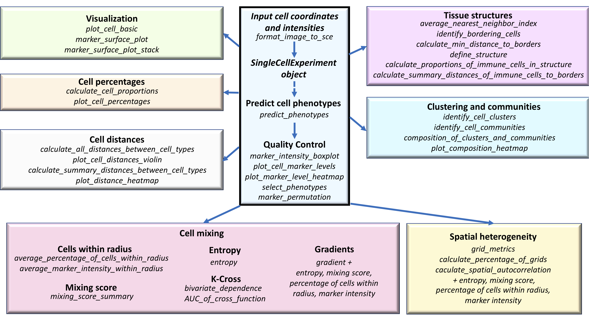
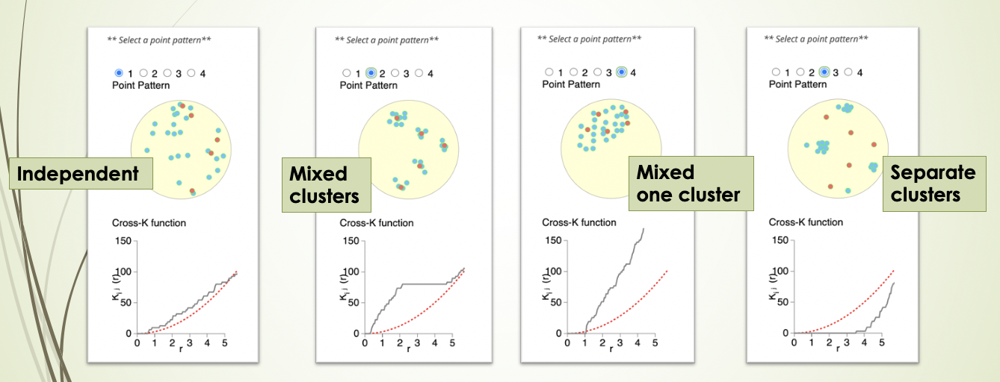
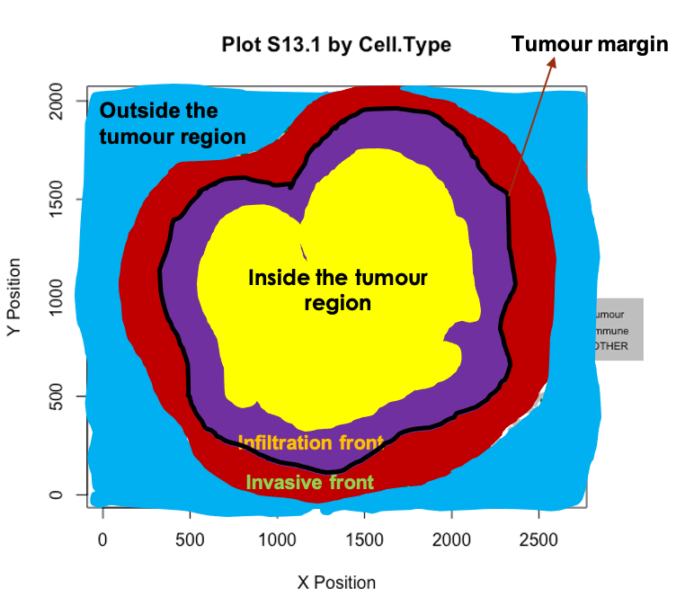

```{r setup, include=FALSE}
knitr::opts_chunk$set(echo = TRUE)
```

# MATERIAL UNDER DEVELOPMENT

# Introduction

SPIAT (**Sp**atial **I**mage **A**nalysis of **T**issues) is an R package with a suite of data processing, quality control, visualization, data handling and data analysis tools [@yang2020spiat]. SPIAT is directly compatible with Opal multiplex immunohistochemistry images analysed through the HALO and InForm analysis software, but its intuitive implementation allows use with a diversity of platforms.

The Opal multiplex immunohistochemistry staining protocol enables 6-8 tissue markers to be used simultaneously on a single slide. It is suitable for use with formalin fixed paraffin embedded (FFPE) tissue sections, so it is also of relevance for clinical practice. The fluorescence of each marker is measured through imaging, and each cell is assigned an X,Y coordinate of its location. In effect this provides single-cell resolution. The fluorescence intensity of individual markers are then combined to identify the phenotype of the cells in the tissue.

SPIAT includes novel algorithms for the identification of cell clusters, cell margins and cell gradients, the calculation of neighbourhood proportions, and algorithms for the prediction of cell phenotypes in tissue images. SPIAT also includes speedy implementations of the calculation of cell distances and detection of cell communities. An overview of the functions available is shown in the figure below. 


```{r echo=FALSE, fig.align="center"}

```

# Setting up the data

First we load the SPIAT library.

```{r message=FALSE}
library(SPIAT)
```


We can use `format_image_to_sce` to read in and format raw data for SPIAT.`format_image_to_sce` creates a SingleCellExperiment object. It requires at least 4 arguments:

- `format`: "INFORM", "HALO", "Visium", "CODEX" "cellprolifer, or "general"
- `image`: path to the raw InForm or HALO image data file
- `markers`: names of markers used in the OPAL staining. These must be in the same order as the marker columns in the input file, and for InForm must match the marker name used in the input file. One of the markers must be DAPI.
- `locations`: locations of the markers, either Nucleus, Cytoplasm or Membrane. These must be in the order of the markers. The locations are used to auto-detect the intensity (and dye) columns. Alternatively, the column names can be specified, see below for more information.

## Simple import

The simplest way to read in both InForm and HALO files, is to specify the locations of the markers as shown below. This will automatically detect the appropriate intensity (and dye) columns to use. Here we use a tiny InForm file that's part of the SPIAT package for `raw_inform_data` but you would replace `system.file` with `/path/to/your/input/file`. The tiny file is just for demonstrating importing a raw data file, later in the [Example data](#example-data) section we load a larger preformatted dataset. For information on the InForm and HALO formats see below. For  "Visium", "CODEX" or "cellprolifer see the help (`?format_image_to_sce`). Format "general" allows you to input a matrix of intensities (`intensity_matrix`), and a vector of `phenotypes`, cell phenotypes in the same order in which they appear in intensity_matrix. They should be of the form "CD3,CD8", as opposed to cell names (e.g. "cytotoxic T cells"), as it does some matching with the marker names. If no phenotypes are available, then a vector of NA can be used as input. For general format, you also need to provide a vector with the X coordinates of the cells and one with the Y (`coord_x` and `coord_y`). The cells must be in the same order as in the intensity_matrix. If you have Xmin and Xmax columns (and Ymin, Ymax) you can calculate the average and input that. 

```{r message=FALSE}
raw_inform_data <- system.file("extdata", "tiny_inform.txt.gz", package = "SPIAT")
markers <- c("DAPI", "CD3", "PDL-1", "CD4", "CD8", "AMACR")
locations <- c("Nucleus", "Cytoplasm", "Membrane", "Cytoplasm", "Cytoplasm", "Cytoplasm")
formatted_image <- format_image_to_sce(
                          format="INFORM",
                          path=raw_inform_data,
                          markers=markers,
                          locations=locations)
```

## InForm input

#### Intensity columns

If for some reason you don't want to specify the `locations`, you can specify the intensity columns with `intensity_columns_interest` as shown below. This will give the same result as specifying the locations above. 

```{r message=FALSE, eval=FALSE}
raw_inform_data <- system.file("extdata", "tiny_inform.txt.gz", package = "SPIAT")
markers <- c("DAPI", "CD3", "PDL-1", "CD4", "CD8", "AMACR")
intensity_columns_interest <- c(
  "Nucleus DAPI (DAPI) Mean (Normalized Counts, Total Weighting)",
  "Cytoplasm CD3 (Opal 520) Mean (Normalized Counts, Total Weighting)", 
  "Membrane PDL-1 (Opal 540) Mean (Normalized Counts, Total Weighting)",
  "Cytoplasm CD4 (Opal 620) Mean (Normalized Counts, Total Weighting)",
  "Cytoplasm CD8 (Opal 650) Mean (Normalized Counts, Total Weighting)", 
  "Cytoplasm AMACR (Opal 690) Mean (Normalized Counts, Total Weighting)"
  )
formatted_image <- format_image_to_sce(
                          format="INFORM",
                          path=raw_inform_data,
                          markers=markers,
                    intensity_columns_interest=intensity_columns_interest)
```

#### X and Y location columns

`format_image_to_sce` uses the Cell X Position and Cell Y Position columns in the InForm raw data.

#### Phenotype column

`format_image_to_sce` uses the Phenotype column in the InForm raw data. The phenotype of a cell can be a single marker, for example, "CD3" (T cell), or a combination of markers, such as "CD3,CD4" (helper T cell). "OTHER" means a cell was positive for DAPI but no other marker. The phenotypes must be based on the markers (e.g. CD3,CD4), rather than names of cells (e.g. cytotoxic T cells). The names of the cells can be added later using the `define_celltypes` function.

#### Cell properties columns

The following cell properties columns are required to be present in the InForm input file: Entire Cell Area (pixels), Nucleus Area (pixels), Nucleus Compactness, Nucleus Axis Ratio, and Entire Cell Axis Ratio. 


## HALO input

#### Intensity columns

For HALO you can also just specify the `locations` to auto-detect the columns as shown above. But if you want to specify the columns instead, you can do so with `intensity_columns_interest`, as shown in the example below. Note that then you also must specify the `dye_columns_interest`.

#### Dye columns

`format_image_to_sce` requires the HALO dye columns to assign the phenotype. If not using `locations` to auto-detect, these can be specified with `dye_columns_interest`. These columns have the marker status (1 or 0 for whether the cell is positive or negative for the marker) and these are used to create the phenotype column. For example, if HALO has assigned a cell a marker status of 1 for CD3 and 1 for CD4, SPIAT will give it the Phenotype "CD3,CD4". Cells that have a marker status of 1 for DAPI and no other marker, are given the phenotype "OTHER".

```{r message=FALSE, eval=FALSE}
raw_halo_data <- "path/to/halo/file"
markers <- c("DAPI", "CD3", "PDL-1", "CD4", "CD8", "AMACR")
intensity_columns_interest <- c("Dye 1 Nucleus Intensity",
                                "Dye 2 Cytoplasm Intensity",
                                "Dye 3 Membrane Intensity",
                                "Dye 4 Cytoplasm Intensity",
                                "Dye 5 Cytoplasm Intensity",
                                "Dye 6 Cytoplasm Intensity")
dye_columns_interest <- c("Dye 1 Positive Nucleus",
                          "Dye 2 Positive Cytoplasm",
                          "Dye 3 Positive Membrane",
                          "Dye 4 Positive Cytoplasm",
                          "Dye 5 Positive Cytoplasm",
                          "Dye 6 Positive Cytoplasm")
formatted_image <- format_image_to_sce(
                          format="HALO",
                          path=raw_halo_data,
                          markers=markers,
                          intensity_columns_interest=intensity_columns_interest,
                          dye_columns_interest=dye_columns_interest
                          )
```

#### X and Y location columns

`format_image_to_sce` takes the average of the HALO X min and X max columns for each cell to create the Cell.X.Position column. It takes the average of the Y min and Y max to create the Cell.Y.Position column.

#### Phenotype column

`format_image_to_sce` creates the Phenotype column from the dye columns as described under the Dye columns section above.

#### Cell properties columns

The following cell properties columns are required to be present in the HALO input file: Cell Area, Nucleus Area, Cytoplasm Area. 


## Splitting images

In the case of large images, or images where there are two independent tissue sections, it is recommended to split images into sections defined by the user. This can be performed with `image_splitter` after `format_image_to_sce`. It can also plot the different combinations of markers within the image segments.

```{r}
split_image <- image_splitter(formatted_image, number_of_splits=3, plot = FALSE)
```

## Example data {#example-data}

In this vignette we will use an InForm data file that's already been formatted for SPIAT with `format_image_to_sce`, which we can load with `data`.
```{r}
data("formatted_image")
```

This is *SingleCellExperiment* format.

```{r}
class(formatted_image)
```

This example data has 6 markers and 8419 cells.

```{r}
dim(formatted_image)
```

`assay` stores the intensity level of every marker (rows) for every cell (columns). 

```{r}
# take a look at first 5 columns
assay(formatted_image)[, 1:5]
```

`colData` stores the phenotype, x and y coordinates, and the cell properties.

```{r}
# take a look at first 5 rows
colData(formatted_image)[1:5, ]
```

We can check what phenotypes are present with `print_column`, which will print any specified column in the data.

```{r}
print_column(formatted_image, column = "Phenotype")
```

The phenotypes in this example data can be interpreted as follows: 

* AMACR = prostate cancer cells  
* CD3,CD4 = helper T cells  
* CD3,CD8 = cytotoxic T cells
* CD3 = T cells that are not helper or cytotoxic
* PDL-1 = immune checkpoint cells
* OTHER = other cell types

AMACR identifies which cells in the image are prostate cancer cells. CD3,CD4, CD3,CD8, CD3 which types of T cells (immune cells) are present, and PDL-1 is used to help determine if the cancer may benefit from immunotherapy treatment.


# Predicting cell phenotypes

SPIAT can predict cell phenotypes using the marker intensity levels with `predict_phenotypes`. This can be used to check the phenotypes that have been assigned by InForm and HALO. It can also potentially be used to automate the manual phenotypying performed with InForm/HALO. `predict_phenotypes` produces a density plot that shows the cutoff for calling a cell positive for a marker. It also prints to the console the number of true positives (TP), true negatives (TN), false positives (FP) and false negatives (FN). It returns a table containing the phenotypes predicted by SPIAT and the actual phenotypes from InForm/HALO. This can help show if we need to go back to Inform or HALO to refine the phenotyping. If you don't have a `tumour_marker` you can use a marker that is present in many cells, that has at least one peak more than the main marker peak, a background peak, required by the algorithm. Of note, this algorithm does not take into account cell shape or size, so if these are required for phenotyping, manual phenotyping with HALO or InForm is recommended.

```{r}
predicted_image <- predict_phenotypes(formatted_image,
                                      thresholds = NULL,
                                      tumour_marker = "AMACR",
                                      baseline_markers = c("CD3", "CD4", "CD8"),
                                      reference_phenotypes = FALSE)
```

We can use `marker_prediction_plot` to plot the predicted cell phenotypes and the ones obtained using HALO or InForm, for comparison. 

```{r}
#marker_prediction_plot(predicted_image, marker="CD3")
```

The plot shows CD3+ cells in the tissue. On the left are the CD3+ cells defined by InForm and on the right are the CD3+ cells predicted using SPIAT.

## Specifying cell types

Specifying each Phenotype can be tedious if the Phenotype consists of multiple markers. To make it easier, SPIAT `define_celltypes` can be used to add a column indicating the cell type. By default the column is called Cell.Type. The difference between Phenotype and Cell.Type is that phenotype represents all the markers present on the cell but Cell.Type is the identity of the cell.

```{r}
formatted_image <- define_celltypes(formatted_image, phenotypes = c("AMACR", "CD3,CD4", "CD3,CD8", "CD3", "PDL-1"), names = c("Tumour", "T_helper", "T_cyto", "T_other", "PDL1"))
```

# Quality control


## Boxplots of marker intensity

Incorrect or unreliable phenotyping of cells may also be identified through comparing the marker level for cells labelled positive and negative for a marker. Cells positive for a marker should have high levels of the marker. An unclear separation of marker intensities between positive and negative cells would suggest phenotypes have not been accurately assigned. We can use `marker_intensity_boxplot` to produce a boxplot for cells phenotyped as being positive or negative for a marker.


```{r}
marker_intensity_boxplot(formatted_image, "CD3")
```

Note that some negative cells will have high marker intensity, and vice versa. This is because HALO and InForm use machine learning to determine positive cells, and not a strict threshold, and also take into account properties such as cell shape, nucleus size etc.
.

## Scatter plots of marker level

Uneven marker staining or high background intensity can be identified with `plot_cell_marker_levels`. This produces a scatter plot of the intensity of a marker in each cell. Cells that were not phenotyped as being positive for the particular marker are excluded.

```{r}
plot_cell_marker_levels(formatted_image, "CD3")
```

## Heatmaps of marker level

For large images, there is also the option of ‘blurring’ the image, where the image is split into multiple small areas, and marker intensities are averaged within each. The image is blurred based on the `num_splits` parameter.

```{r}
plot_marker_level_heatmap(formatted_image, num_splits = 100, "AMACR")
```
## Identifying incorrect phenotypes

We may see incorrect phenotypes present in the input data. For example, cells might be incorrectly assigned a phenotype such as "AMACR,CD3", both a tumour cell (AMACR) and an immune cell phenotype (CD3), which is biologically implausible. Incorrect cell phenotypes may be present due to low cell segmentation quality, antibody ‘bleeding’ from one cell to another or inadequate marker thresholding.

We can use `marker_permutation` to help identify if incorrect cell phenotypes are present. This permutes the marker labels of cells to create a null distribution, and then calculates the empirical p-value of whether an image is enriched or depleted in a particular combination of markers. A low P value for Depletion.p suggests the phenotype is unreliable. However, it is not absolute and it is recommended to review the results.

```{r}
# permute marker labels of cells
sig <- marker_permutation(formatted_image, num_iter = 100)

# sort by Observed_cell_number
sig.sorted <- sig[order(-sig$Observed_cell_number), ]

# take a look
head(sig.sorted)
```

## Removing incorrect phenotypes

If you identify incorrect phenotypes or have any you want to exclude you can do that with `select_phenotypes`. 

```{r}
data_subset <- select_phenotypes(formatted_image, keep=TRUE,
                                     phenotypes = c("AMACR",
                                                    "CD3,CD8",
                                                    "PDL-1"))
print_column(data_subset, column = "Phenotype")
```

In this vignette we will work with all the original phenotypes present in `formatted_image`.


# Cell percentages

We can obtain the number and proportion of each cell type with `calculate_cell_proportions`. We can use `reference_celltypes` to specify cell types to use as the reference. For example, "Total" will calculate the proportion of each cell type against all cells. We can exclude any cell types that are not of interest e.g. "Undefined" with `celltypes_to_exclude`.

```{r}
p_cells <- calculate_cell_proportions(formatted_image, reference_celltypes=c("Total"), column="Cell.Type")
p_cells
```

To visualize the cell type proportions as barplots we can use `plot_cell_percentages`.

```{r}
plot_cell_percentages(p_cells)
```


# Visualizing tissues

In addition to the marker level tissue plots for QC, SPIAT has other methods for  visualizing markers and phenotypes in tissues.


## 3D surface plot

We can visualize a selected marker in 3D with `marker_surface_plot`. The image is blurred based on the `num_splits` parameter.

```{r}
marker_surface_plot(formatted_image, num_splits=15, marker="CD3")
```

## 3D stacked surface plot

To  visualize multiple markers in 3D in a single plot we can use `marker_surface_plot_stack`. This shows normalized intensity level of specified markers and enables the identification of co-occurring and mutually exclusive markers. 

```{r}
marker_surface_plot_stack(formatted_image, num_splits=15, markers=c("AMACR", "CD3"))
```

The stacked surface plots of the AMACR (tumour cell) and CD3 (T cell) markers in this prostate tissue shows how AMACR and CD3 are mutually exclusive as the peaks and valleys are opposite.

## Categorical dot plot

We can see the location of all cell types (or any column in the data) in the tissue with `plot_cell_basic`. Each dot in the plot corresponds to a cell and cells are coloured by cell type. Any cell types present in the data but not in the cell types of interest will be put in the category "OTHER" and coloured lightgrey.

```{r}
my_colors <- c("darkgrey", "skyBlue", "darkcyan", "white", "orange")
  
plot_cell_basic(formatted_image, c("Tumour", "T_helper", "T_cyto", "T_other", "PDL1"), my_colors, "Cell.Type")
```

# Cell distances

We can calculate the distances between two cell types (cell type A and cell type B) by identifying the closest cell of cell type B to each of the cells of cell type A with `calculate_all_distances_between_cell_types`.

```{r}
distances <- calculate_all_distances_between_cell_types(formatted_image, cell_types_of_interest = c("T_helper", "T_cyto"), column="Cell.Type")
```

This creates a distribution of minimum distances between phenotypes A and B, which can be visualized as a violin plot with `plot_cell_distances_violin`. Visualization of this distribution often reveals whether pairs of cells are evenly spaced across the image, or whether there are clusters of pairs of phenotypes. 

```{r}
plot_cell_distances_violin(distances)
```

From this plot we can see that T_helper cells seem to be more closely interacting with each other, as there are shorter distances between those cells, than between T_cyto cells or between T_helper and T_cyto cells.

We can also calculate summary statistics for the distances between each combination of cell types, the mean, median and standard deviation, with `calculate_summary_distances_between_cell_types`.

```{r}
summary_distances <- calculate_summary_distances_between_cell_types(formatted_image, column = "Cell.Type")
```

These cell distances can then be visualized as a heatmap with `plot_distance_heatmap`.

```{r}
plot_distance_heatmap(summary_distances)
```

This plot shows that Tumour cells are interacting most closely with T_helper, followed by T_cyto, while PDL1 cells are more distant.

# Cell mixing 

With SPIAT we can quantify how much two cell types are mixing, and thus potentially interacting, through a variety of ways.

## Cells within radius

To determine whether two cell types are interacting with another, or if there is repulsion between them, SPIAT uses the concept of gradients. The assumption is that, if marker A intensity is high close to cells of marker B, and this value decreases as the distance from B increases, it suggests the cells are close and interacting. Conversely, if we see that marker A intensity is low when close to cells of marker B but increases with distance, it suggests there is repulsion between the two cell types. 

`plot_average_intensity` calculates the average intensity of a target marker for a number of user-supplied radii values. It plots the intensity level at each specified radius as a line graph. The radius unit is pixels.

```{r}
plot_average_intensity(formatted_image, reference_marker="CD8", target_marker="CD4", c(30, 35, 40, 45, 50, 75, 100))
```

This plot shows that high levels of CD8 were observed in cells near CD4 cells and these levels decreased at larger radii. This suggests CD4 and CD8 cells may be closely interacting in this tissue.

We can use `average_marker_intensity_within_radius` to calculate the average intensity of the target_marker within a radius from the cells positive for the reference marker. Note that it pools all cells with the target marker that are within the specific radius of any reference cell. Results represent the average intensities within a radius, but do not correspond to metrics for each cell. This function can also be used to help identify radii values for `plot_average_intensity`.

```{r}
average_marker_intensity_within_radius(formatted_image,
                                        reference_marker ="CD8",
                                        target_marker = "CD4",
                                        radius=30)
```


We can calculate the average percentage of cells of one cell type (target) within a radius of another cell type (reference).

```{r}
average_percentage_of_cells_within_radius(formatted_image, reference_phenotypes = "T_helper", target_phenotypes = "T_cyto", radius=100, 
column="Cell.Type")
```

## Mixing score

This score was originally defined as the number of immune-tumor interactions divided by the number of immune-immune interactions [@keren2018structured]. SPIAT generalizes this method to allow calculation of any two cell types. `mixing_score_summary` returns the mixing score between a reference cell type and a target cell type. This mixing score is defined as the number of target-reference interactions/number of reference-reference interactions within a specified radius. The higher the score the greater the mixing of the two cell types. The normalised score is normalised for the number of target and reference cells in the image.


```{r}
mixing_score_summary(formatted_image, reference_marker = "T_helper", target_marker = "T_cyto", radius=100, column="Cell.Type")
```

## K-Cross function

K-cross function is similar to mixing score, but calculates the score across all possible distances. It also compares the behaviour of the image with an image that has randomly distributed points of the same number. There are 4 patterns that can be distinguished from  K-cross function, as illustrated in the plots below (generated [ here](https://blog.jlevente.com/understanding-the-cross-k-function/)). 

```{r, echo=FALSE}

```

Here, the black line represents our image, the red line represents a randomly distibuted point pattern. 

* 1st plot: The red line and black line are close to each other, it means the two types of points are randomly independently distributed.  
* 2nd plot: The red line is under the black line, and in the middle the difference is dramatic, it means the points are mixed and split into clusters.  
* 3rd plot: With the increase of radius, the black line diverges further from the red line, it means that there is one mixed cluster of two types of points.  
* 4th plot: The red line is above the black line, it means that the two types of points form separated clusters.

We can calculate the cross K-function using SPIAT.

```{r}
df_cross <- bivariate_dependence(formatted_image, method = "Kcross", phenotypes = c("T_helper","T_cyto"), column ="Cell.Type")
```

The plot tells us that the T_cyto and T_helper form one mixed cluster, as it looks like the 3rd plot above.

We can calculate the area under the curve (AUC) of the cross K-function. This tells us the two types of cells are:  

* separate clusters - the more negative it is
* independent - the closer it is to zero
* mixed - the more positive it is

```{r}
AUC_of_cross_function(df_cross)
```

The AUC score is very positive so this tells us that the two types of cells form mixed clusters, similar to the plot. 

## Entropy

We can calculate the entropy of the cells.

```{r}
entropy(formatted_image, types_of_interest = c("T_helper","T_cyto"), column = "Cell.Type")
```

## Gradients

We can use the `gradient` function to calculate metrics (entropy, mixing score, percentage of cells within radius, marker intensity) for a range of radii. We specify the metric we want to calculate with `FUN=`.

```{r}
gradient_positions <- c(30, 50, 100)
gradient_entropy <- gradient(formatted_image, radii=gradient_positions, FUN=entropy, types_of_interest = c("T_helper","T_cyto"), column = "Cell.Type")
```


# Tissue structures

If the image contains tumour, it may be a clear tumour structure or unclear (dispersed). The function `average_nearest_neighbor_index` can inform us whether there is a clear tumour structure (clustered) or unclear (dispersed), along with a P value for the estimate.

```{r}
average_nearest_neighbor_index(formatted_image, reference_cell="Tumour", column="Cell.Type")
```

When there is a clear tumour region in the image, we define four tumour structures: "Inside", "Outside", "Infiltration front" and "Invasive front", as shown in the figure below. Why are we interested in defining such structure? For some types of cancer, there can be small clusters of tumour cells, like globes. We may be interested in not only whether immune cells infiltrate into the whole tumour region but also whether the immune cells infiltrate into the small globes. The identification of the tumour structure can be achieved by calculating the distance from each cell to the tumour boundary, after the identification of bordering cells. 


```{r, echo=FALSE}

```

We can identify borders with `identify_bordering_cells`. This uses the alpha hull method [@alphahull] via the [hull2spatial](https://github.com/babichmorrowc/hull2spatial) package. Here we use tumour cells (AMACR) as the reference to identify the bordering cells but any cell type can be used.

```{r}
formatted_border <- identify_bordering_cells(formatted_image, reference_cell = "Tumour", column="Cell.Type")
```

We then calculate the distance of each cell to the borders.

```{r}
formatted_distance <- calculate_min_distance_to_borders(formatted_border)
```

We define the area within a 5-cell distance to the boundary as "infiltration front" (inside) and "invasive front" (outside). The areas located more than a 5 cell-distance away from the boundary are defined as "in" (inside) and "out" (outside).

```{r}
names_of_immune_cells <- c("T_helper", "T_cyto")

formatted_structure <- define_structure(formatted_distance, names_of_immune_cells = names_of_immune_cells, 
n_margin_layers = 5)

categories <- print_column(formatted_structure, "Structure")
```

We can plot and colour these structure categories.

```{r}
my_colors <- c("yellow", "darkblue", "darkgreen", "black", "purple", "orange", "darkgreen", "pink", "green")

plot_cell_basic(formatted_structure, categories, 
                  my_colors,
                  column = "Structure")
```

We can calculate the proportion of immune cells in the tumour structure.

```{r}
immune_proportions <- calculate_proportions_of_immune_cells_in_structure(formatted_structure, immune_cells = names_of_immune_cells, column="Cell.Type")

immune_proportions
```

We can calculate summaries of the distances for immune cells in the tumour structure.

```{r}
immune_distances <- calculate_summary_distances_of_immune_cells_to_borders(formatted_structure, names_of_immune_cells, "Cell.Type")

immune_distances
```

# Clusters and communities

We can determine if there are aggregates (or a lack of aggregates) of a particular phenotype or combination of cell types. SPIAT can be used to identify two types of cell aggregates, clusters and communities. 

Clusters are cell aggregates composed of non-tumour cells, often by immune cells. For the detection of clusters, `identify_cell_clusters` only considers cell types of interest defined by the user. Euclidean distances between cells are calculated, and pairs of cells with a distance less than a threshold are considered to be ‘interacting’, with the rest being ‘non-interacting’. Hierarchical clustering is then used to separate the clusters. We need to specify a radius. The radius corresponds to how lenient we are in defining clusters. A bigger radius would mean we are more likely to merge individual clusters. The radius is chosen based on what looks ‘reasonable’. Cells not assigned to clusters ("free" cells) are assigned to Cluster_NA in the output table.

```{r}
clusters <- identify_cell_clusters(formatted_image, cell_types_of_interest = c("T_helper", "T_cyto"), radius = 100, column = "Cell.Type")
```

This plot shows clusters of CD3,CD4 and CD3,CD8 cells. Each number and colour corresponds to a distinct cluster. Black cells correspond to ‘free’, un-clustered cells. 

Users are recommended to test out different thresholds and then  visualize the clustering results. But SPIAT also has `average_minimum_distance`, which calculates the average minimum distance between all cells in an image, and can be used as a starting point.

```{r}
average_minimum_distance(formatted_image)
```

Communities correspond to micro-niches or micro-ecosystems of cells that are located close to each other [@jackson2020single]. The main distinction between clusters and communities is that the algorithm for the detection of communities used by `identify_cell_communities` does not take into account cell phenotype. Therefore, communities often consist of a combination of different cell types, including tumour cells. *dbscan* is used as the clustering algorithm to detect communities [@hahsler2019dbscan]. Cells without a phenotype are excluded.

```{r}
communities <- identify_cell_communities(formatted_image, radius=100)
```

This plot shows communities of cells in the tissue. Each number and colour corresponds to a distinct community. 

We can visualize the cell composition of clusters or communities. This allows us to determine whether there are regions where cells of different types are interacting, or whether there is little mixing between celltypes. To do this, we can use `composition_of_clusters_and_communities` to obtain the percentages of cells with a specific marker within each cluster and the number of cells in the cluster.

```{r}
clusters_vis <- composition_of_clusters_and_communities(clusters, type_of_aggregate = "Cluster", column = "Cell.Type")
clusters_vis <- clusters_vis[clusters_vis$Total_number_of_cells >=5,]
```

Then we can use `plot_composition_heatmap` to produce a heatmap showing the marker percentages within each cluster.

```{r}
plot_composition_heatmap(clusters_vis, type_of_aggregate = "Cluster", column="Cell.Type")
```

This plot shows that most clusters are composed of a mixture of T_helper and T_cyto cells and some are more dominated by T_helper than others.  

We can visualize the composition of the communities in a similiar way.

```{r}
communities_vis <- composition_of_clusters_and_communities(communities, type_of_aggregate="Community", column = "Cell.Type")
plot_composition_heatmap(communities_vis, type_of_aggregate = "Community", column="Cell.Type")
```

This plot shows that several communities detected have a combination of tumour (AMACR) and immune cells while some are dominated by tumour or immune cells.


# Reproducibility

```{r}
sessionInfo()
```

# Author Contributions
AT, YF, TY, ML, JZ, VO, MD are authors of the package code. MD wrote the vignette. AT designed the package.

# References
